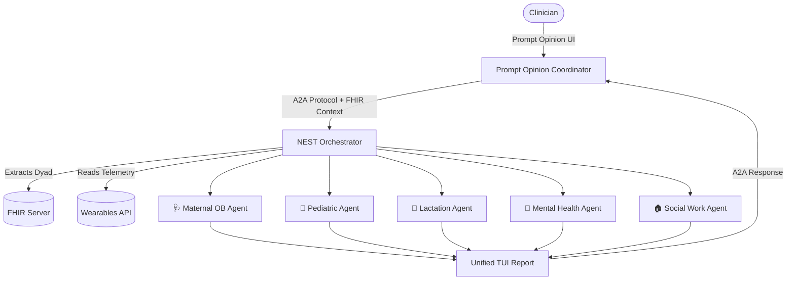

# NEST: Newborn & Maternal Safe Transition


**NEST** is an advanced A2A (Agent-to-Agent) clinical orchestrator built for the **Prompt Opinion** platform (Agents Assemble Hackathon 2026). It solves one of the most dangerous gaps in healthcare: the fragmented postpartum handoff between maternal and infant charts.

Instead of a single LLM trying to guess guidelines, NEST binds the mother-infant dyad and convenes **five specialized AI agents** in parallel to generate a unified, evidence-backed discharge plan.

---

## ✨ Key Features

*   **Multi-Agent Council:** Runs 5 parallel specialists (Maternal OB, Pediatrics, Lactation, Mental Health, Social Work) using the Google ADK.
*   **FHIR Dyad Binding:** Automatically extracts both maternal and infant clinical data from a single maternal FHIR `patientId` provided by Prompt Opinion.
*   **Wearables Telemetry Stream:** Integrates real-time data from Apple Watch (Maternal BP/HR) and Owlet Dream Sock (Infant SpO2/HR).
*   **Claude Code TUI Aesthetic:** Returns a beautiful, high-signal Terminal UI (TUI) output with ASCII boxes, Kanban task boards, and color-coded alerts.
*   **Evidence Anchors:** Combats hallucination by strictly linking every generated recommendation to curated clinical guidelines (ACOG, AAP, LactMed).

---

## 🧠 The Architecture



---

## 🚀 Quick Start (Local Development)

### 1. Install Dependencies
```bash
python3 -m venv .venv
source .venv/bin/activate
pip install -r requirements.txt
```

### 2. Configure Environment
Create a `.env` file in the root directory:
```env
# Your Gemini / LiteLLM API Key
GOOGLE_API_KEY=your_gemini_api_key

# The API Key you will put into Prompt Opinion's Agent Card
API_KEYS=your_secret_a2a_key

# Model Selection
NEST_ORCHESTRATOR_MODEL=gemini/gemini-2.5-flash
```

### 3. Run the Server
```bash
uvicorn nest_agent.app:a2a_app --host 0.0.0.0 --port 8005
```

### 4. Expose via ngrok
```bash
ngrok http 8005
```
Take the resulting `https://...ngrok-free.dev` URL and append `/.well-known/agent-card.json` to use in Prompt Opinion.

---

## ☁️ Cloud Deployment (Render)

This repository is pre-configured for 1-click deployment on Render.com.

1. Connect this GitHub repository to Render as a **Web Service**.
2. **Build Command:** `pip install -r requirements.txt`
3. **Start Command:** `uvicorn nest_agent.app:a2a_app --host 0.0.0.0 --port $PORT`
4. Add your `.env` variables in the Render dashboard.

---

## 🛠️ Usage in Prompt Opinion

1. Go to **Prompt Opinion -> External Agents -> Add Connection**.
2. Paste your Agent Card URL: `https://<your-domain>/.well-known/agent-card.json`
3. Enter your `API_KEYS` value in the auth header.
4. Upload the Skill Packages located in `nest_agent/prompt_opinion/po_skill_packages/`.
5. Ask your coordinator: *"Is the patient ready for discharge?"* or *"Check the wearable vitals for the mom and baby."*

---

## ⚖️ License
MIT License. See `LICENSE` for details.
